# Secure Channel // Cryptographic Command Center

Workshop 2 — Applied Cryptographic Design. Individual project by **Pratham**, submitted 24 October 2026.

This project is a secure communication channel written in C with [libsodium](https://doc.libsodium.org/). It uses X25519 key exchange (`crypto_kx`) for session keys, ChaCha20-Poly1305 for encryption, and sequence numbers authenticated as AAD for replay protection. Private keys are stored with 0600 permissions and can be wrapped under a passphrase with Argon2id. Everything is compared against the OpenSSL command-line tool. A local web dashboard drives the **real** C binaries, so every PASS, BLOCKED and ACCEPTED on screen is a return code from the implementation. It is an educational channel, not a replacement for TLS.

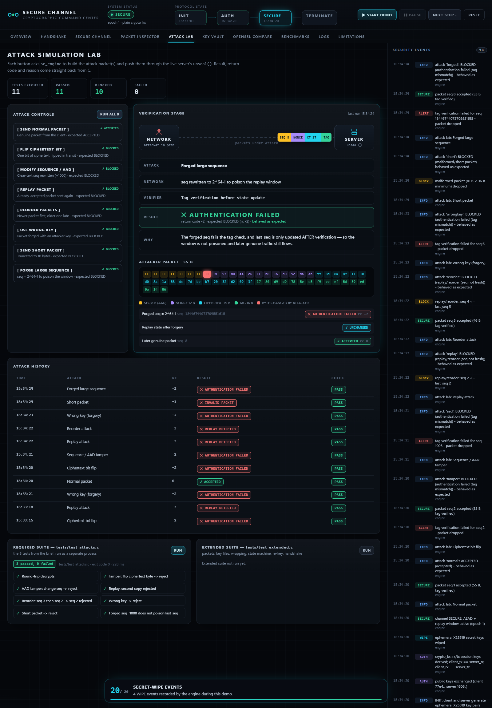

## Features

**Required tasks (from the brief)**
- **Task 1:** Ed25519 and X25519 key generation. Private keys are created with `open(…, 0600)` + `fchmod`, reloaded and functionally verified, then wiped with `sodium_memzero`.
- **Task 2:** `crypto_kx` session keys, direction-separated (`client_tx == server_rx`, `client_tx != client_rx`).
- **Task 3:** ChaCha20-Poly1305-IETF packets, `[seq 8][nonce 12][ciphertext + tag 16]`, with a random nonce per packet and seq as AAD.
- **Task 4:** Replay and reorder protection, with state updated only after the tag verifies, plus **8 automated attack tests**.
- **Task 5:** Argon2id + `crypto_secretbox` key wrapping. A wrong passphrase is rejected and nothing is released.
- **Task 6:** OpenSSL CLI comparison, including a live CBC bit-flip that OpenSSL decrypts without error.

**Extensions**
- **Authenticated handshake:** the server signs `server_eph ‖ client_eph` with Ed25519, and the client verifies against the pinned `server_pk.bin`. The MITM demo is in `mitm_demo` and in the dashboard.
- **Re-keying:** `crypto_kdf_derive_from_key`, on demand or every N messages, with old keys overwritten.
- **TCP client/server:** localhost TCP (`sc_server` / `sc_client`) with a 4-byte length prefix, the INIT → AUTH → SECURE → TERMINATE states, the signed handshake and re-keying.
- **AEAD benchmark:** ChaCha20-Poly1305 vs AES-256-GCM vs `seal()`, 64 B – 16 KiB, all measured.
- **Web dashboard:** Overview, Handshake, Secure Channel, Packet Inspector, Attack Lab, Key Vault, OpenSSL Compare, Benchmarks, Logs, Limitations, plus a 20-step **Demo Mode**.
- **Terminal demo:** `secure_demo` (menu, guided tour, audit), for presenting without a browser.

## Architecture

```
┌──────────────────────── Windows ────────────────────────┐   ┌──────────── WSL Ubuntu ─────────────┐
│ Browser (dashboard/)  ── HTTP/SSE ──►  bridge/server.js │──►│ sc_engine  (long-running, JSON)     │
│ static HTML/CSS/JS, no CDN          127.0.0.1:8787 only │   │ keygen · test_attacks · keywrap …   │
│                                     whitelisted commands│   │ sc_server / sc_client (TCP :7700)   │
└─────────────────────────────────────────────────────────┘   │ scripts/openssl_compare.sh --json   │
                                                               └─────────────────────────────────────┘
```

| Layer | Files | Role |
|---|---|---|
| Crypto core (C) | `src/keyio.c`, `src/aead.c` | Key files (0600/0644, exact-size reads), `seal()` / `unseal()` |
| Protocol (C) | `src/session.c`, `src/handshake.c`, `src/wrap.c` | State machine, signed handshake, re-key, fingerprints, key wrapping |
| Programs (C) | `src/keygen.c`, `kx_demo.c`, `keywrap.c`, `mitm_demo.c`, `benchmark.c`, `demo.c` | Tasks 1–5 and the extensions |
| Machine interface (C) | `src/engine.c`, `src/json.c` | `sc_engine`: one command per line in, one JSON object per line out |
| Network (C) | `src/net.c`, `tcp_server.c`, `tcp_client.c` | Localhost TCP with length-prefixed frames |
| Bridge (Node, no dependencies) | `bridge/server.js` | Serves the dashboard and runs the binaries through WSL, with validation and anti-CSRF |
| Dashboard | `dashboard/` | Views, demo mode, SVG charts |
| Tests | `tests/`, `bridge/test_integration.js` | Required 8, extended 35, integration 45 |

**Secrets never leave C.** The engine holds session keys in `sodium_malloc()` memory and emits only public keys, nonces, ciphertext, return codes, file metadata and one-way 8-byte BLAKE2b fingerprints. The integration test scans every API response for private-key bytes and passphrases.

## Cryptographic design

| Component | Algorithm / API | Purpose |
|---|---|---|
| Identity | Ed25519 `crypto_sign` | Long-term server key; signs the handshake in the extension |
| Key exchange | X25519 + BLAKE2b `crypto_kx` | Two session keys per connection (rx / tx) |
| Packets | ChaCha20-Poly1305-IETF | Confidentiality + integrity; seq authenticated as AAD |
| Freshness | 64-bit seq, `last_seq` window | Rejects replay and reordering |
| Password KDF | Argon2id `crypto_pwhash` (64 MiB) | Passphrase → wrapping key |
| Key wrap | XSalsa20-Poly1305 `crypto_secretbox` | Private key encrypted at rest |
| Re-key | `crypto_kdf_derive_from_key(…, "SCREKEY1")` | New keys per epoch; old keys overwritten |

## Threat model

The attacker controls the network: they can read, modify, replay, reorder, drop and inject packets, including forged sequence numbers. They cannot read files protected by 0600 permissions and do not know the wrapping passphrase. Plain `crypto_kx` does **not** stop an active man-in-the-middle during the handshake; that is covered by the signed-handshake extension (see Limitations).

## Packet format

```
┌──────────────────┬──────────────┬─────────────────────┬──────────────┐
│ seq (8 B, BE)    │ nonce (12 B) │ ciphertext (n B)    │ tag (16 B)   │
│ clear, but AAD   │ random       │ ChaCha20            │ Poly1305     │
└──────────────────┴──────────────┴─────────────────────┴──────────────┘
total = 36 + n bytes
```

`unseal()` checks things in this order: length → replay window (read-only) → tag. It updates `last_seq` only after the tag verifies. Return codes: `0` accepted · `-1` short/malformed · `-2` authentication failed · `-3` replay/reorder · `-4` output buffer too small.

## Attack Lab

The dashboard's Attack Lab runs each attack against the live session inside `sc_engine`, and `tests/test_attacks.c` runs the same eight attacks as a separate program:

| Attack | Expected | rc | Why it is blocked |
|---|---|---|---|
| Normal packet | ACCEPTED | 0 | length OK, fresh seq, tag verifies |
| Flip ciphertext bit | BLOCKED | -2 | Poly1305 tag mismatch |
| Modify sequence / AAD | BLOCKED | -2 | seq is authenticated as AAD |
| Replay packet | BLOCKED | -3 | seq ≤ last_seq |
| Reorder packets | BLOCKED | -3 | older seq after a newer one |
| Wrong key | BLOCKED | -2 | tag cannot verify under the session key |
| Short packet | BLOCKED | -1 | shorter than 36 B, rejected before any crypto |
| Forge large sequence | BLOCKED | -2 | forged seq fails the tag, `last_seq` unchanged, later genuine packets still accepted |

## Security test results

Measured on Ubuntu (WSL2), gcc 15.2.0, libsodium 1.0.18, OpenSSL 3.5.5, Node 24:

| Suite | Command | Result |
|---|---|---|
| Build | `make` | 11 programs, **0 warnings** (`-Wall -Wextra -Wpedantic -Wshadow -Wformat=2`) |
| Required (brief) | `make test` | **8 passed, 0 failed** + all Task 1/2/5 checkpoints |
| Extended | `./test_extended` | **35 passed, 0 failed** (packets, key files, wrapping, state machine, re-key, handshake) |
| OpenSSL | `make openssl` | all steps as expected (CBC tamper undetected, AEAD rejects) |
| UI/backend integration | `npm run test:ui` | **45 passed, 0 failed** (security controls, all APIs, TCP, secret-leak scan) |

Captured output: [docs/output.txt](docs/output.txt).

## Build instructions

```bash
# Ubuntu / WSL (once)
sudo apt update
sudo apt install -y build-essential libsodium-dev libssl-dev pkg-config openssl git
make env        # print tool versions
make            # build everything
make test       # the brief's checkpoints (8/8)
make check      # make test + extended tests + OpenSSL comparison
make clean
```

**WSL and file permissions.** On a Windows drive (`/mnt/c`, `/mnt/d`), WSL ignores `chmod` unless the drive is mounted with `metadata`, and `./keygen` then correctly reports **FAIL**. To fix it, add the following to `/etc/wsl.conf`, then run `wsl --shutdown`:

```ini
[automount]
options = "metadata"
```

## Demo instructions

**Dashboard** (Windows with Node ≥ 18, and WSL Ubuntu with the packages above):

```powershell
cd "D:\project related 24 oct"      # or the secure-workshop folder
npm run dev                          # builds, starts the bridge, opens http://localhost:8787
```

- **START DEMO** runs the 20-step guided presentation. **PAUSE**, **NEXT STEP** and **RESET** control it.
- Each tab also works on its own. The Attack Lab's **RUN ALL 8** fires every attack live.
- Stop the dashboard with Ctrl+C. On Linux/macOS, run `node bridge/server.js` directly.

**Terminal only:**

```bash
make present          # guided tour, Enter between steps
make demo             # menu
make audit            # security audit dashboard
make mitm             # MITM against plain crypto_kx, then the signed fix
make tcp-server       # terminal 1
make tcp-client       # terminal 2: type  send hello | tamper hi | replay | quit
./keywrap --interactive   # wrap the key with your own passphrase (echo off)
```

`make audit`, Demo Mode and the vault's **GENERATE KEYS** button re-run `./keygen`. That replaces the keys in `keys/`, and the key is re-wrapped with the test-only passphrase.

## OpenSSL comparison

| Property | libsodium (this project) | OpenSSL CLI (as used in the brief) |
|---|---|---|
| Key format | raw bytes (32 B public, 64 B Ed25519 secret) | PKCS#8 / SubjectPublicKeyInfo (ASN.1 DER) |
| Encoding | binary `.bin` | PEM (Base64 + BEGIN/END) |
| Private-key protection | 0600; optional Argon2id wrap | 0600 in OpenSSL 3 (observed); unencrypted unless a passphrase cipher is used |
| Message encryption | ChaCha20-Poly1305 AEAD | `aes-256-cbc`: confidentiality only |
| Tamper detection | yes (16 B tag) | no — the bit-flip decrypted with exit code 0 |
| Password KDF | Argon2id (memory-hard) | PBKDF2 (CPU-hard) |
| Misuse resistance | high | lower — easy to pick an unauthenticated mode |

OpenSSL itself supports AEAD modes through its C API. The weakness shown here belongs to the `openssl enc` CBC workflow from the brief.

## Optional extensions

| Extension | Status | Where |
|---|---|---|
| TCP client/server | Implemented | `sc_server`, `sc_client`, dashboard › Secure Channel |
| Stop MITM (Ed25519-signed handshake) | Implemented, labelled as an extension | `mitm_demo`, dashboard › Handshake |
| Re-keying | Implemented | dashboard › Secure Channel, TCP `--rekey N` |
| Benchmark | Implemented, measured at run time | `aead_bench`, dashboard › Benchmarks |

## Limitations

- **Plain `crypto_kx` is unauthenticated**, and an active MITM can read and rewrite traffic (demonstrated). The signed extension fixes this only if `server_pk.bin` was distributed authentically.
- **Secrets are in process memory** while in use. Session keys use `sodium_malloc` (mlock, guard pages) and are zeroed on terminate, but a privileged attacker or a core dump could still read them.
- **The single `last_seq` window** is strict: fine for TCP, too strict for UDP, which would need a sliding bitmap.
- **Random 96-bit nonces** are safe up to about 2³² messages per key; re-key before that.
- **In TCP mode**, `rekey_every` is announced unauthenticated (an attacker could only cause a denial of service), and rejected packets get a clear-text ALERT frame as a demo convenience.
- **The server handles one client at a time.**
- **This is an educational implementation** and is not a TLS 1.3 or Noise replacement.

## Project structure

```
secure-workshop/
├── Makefile · package.json · README.md · .gitignore · .gitattributes
├── src/        common.h keyio.c aead.c ui.c/h handshake.c/h wrap.c/h session.c/h json.c/h
│               keygen.c kx_demo.c keywrap.c mitm_demo.c benchmark.c demo.c engine.c
│               net.c/h tcp_server.c tcp_client.c
├── tests/      test_attacks.c (required 8) · test_extended.c (35)
├── bridge/     server.js (local API) · test_integration.js (45)
├── dashboard/  index.html · css/app.css · js/{app,api,store,ui,demo}.js · js/views/*.js
├── scripts/    openssl_compare.sh · web_demo.sh
├── keys/       generated keys (never committed; only .gitkeep)
└── docs/       report.md · slides.md · presentation_qa.md · output.txt · screenshots/
```

## Screenshots

All screenshots are real captures of the running dashboard (Edge, 1600×1000), taken while the actual binaries ran.

| | |
|---|---|
| 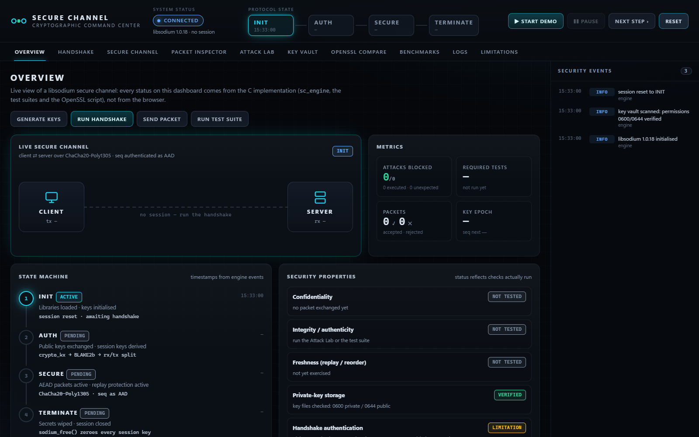 Overview | 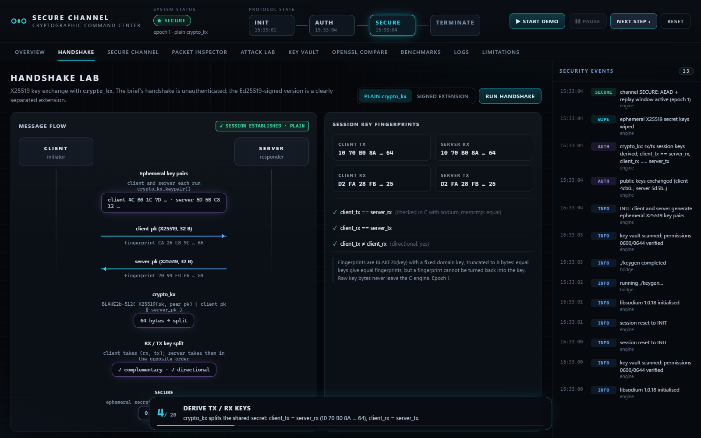 Handshake lab |
| 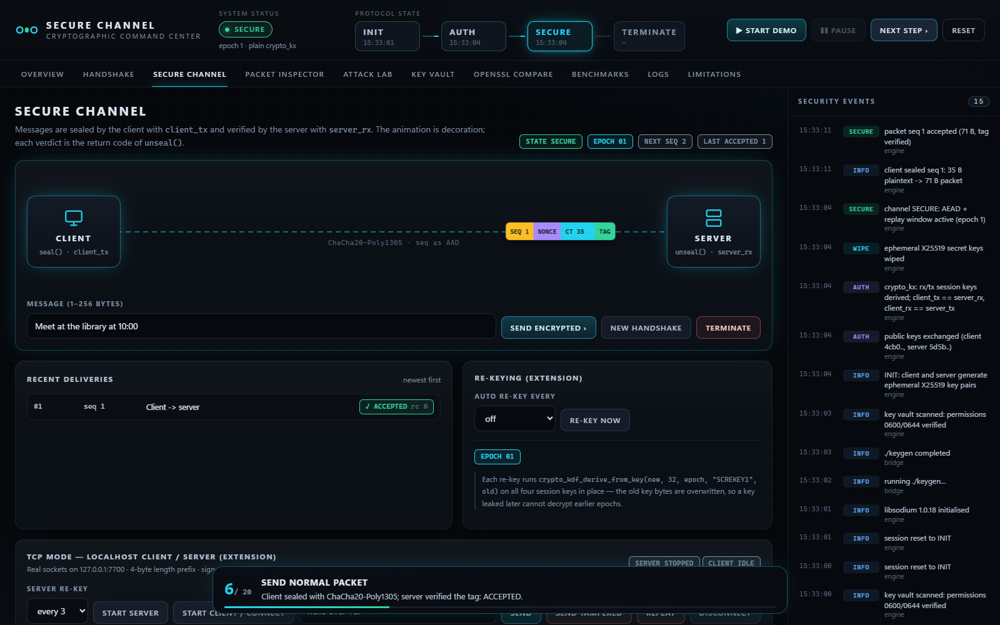 Secure channel | 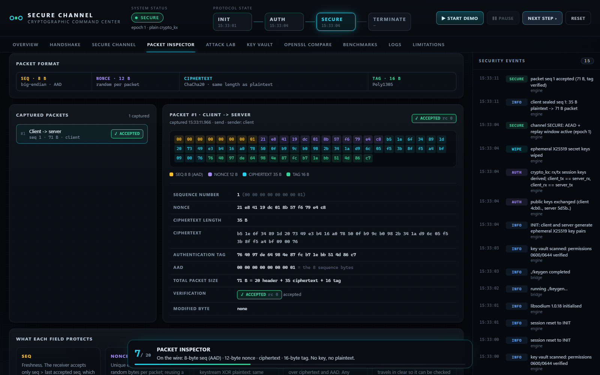 Packet inspector |
| 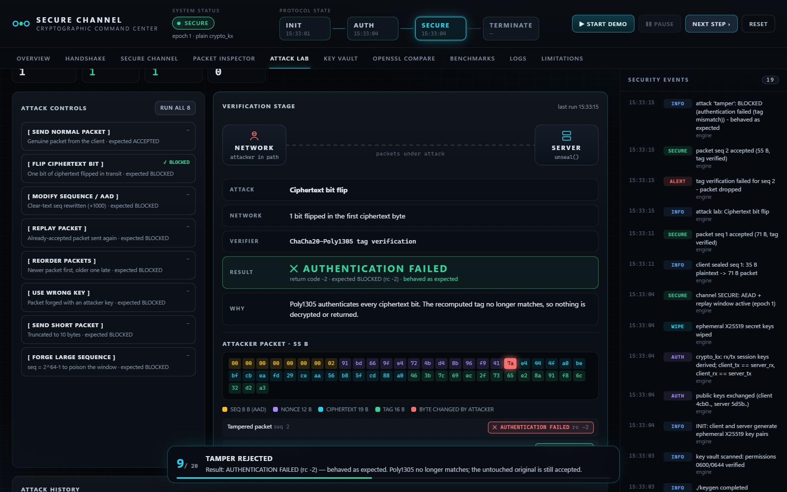 Attack lab: tamper | 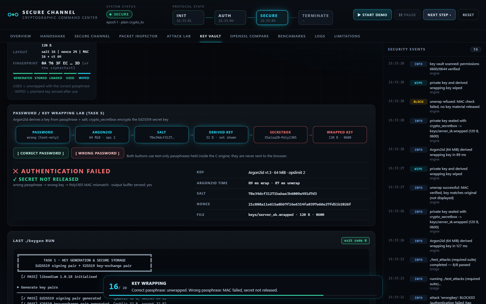 Key wrapping |
| 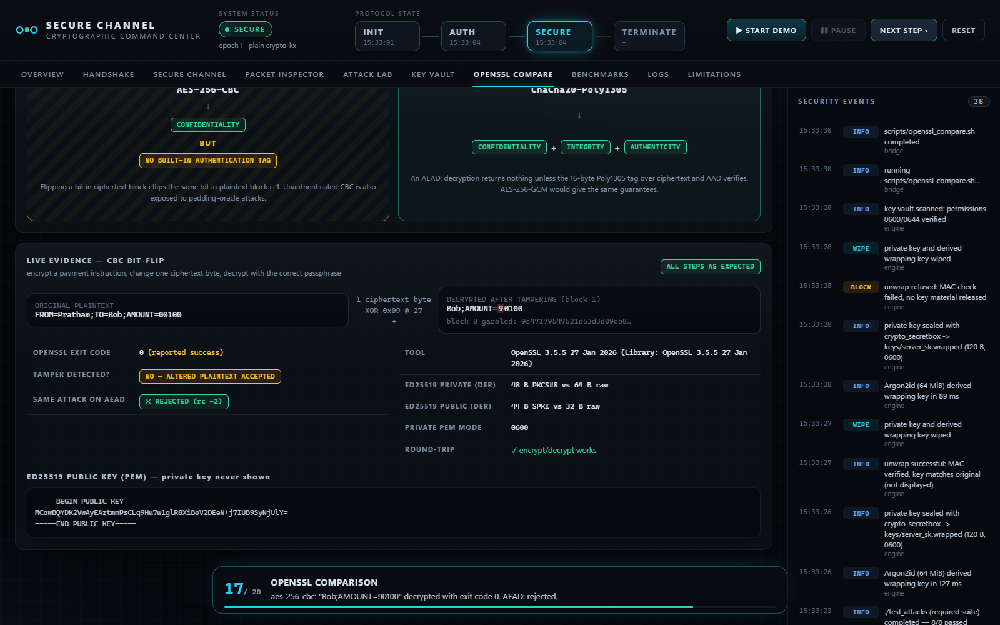 OpenSSL comparison | 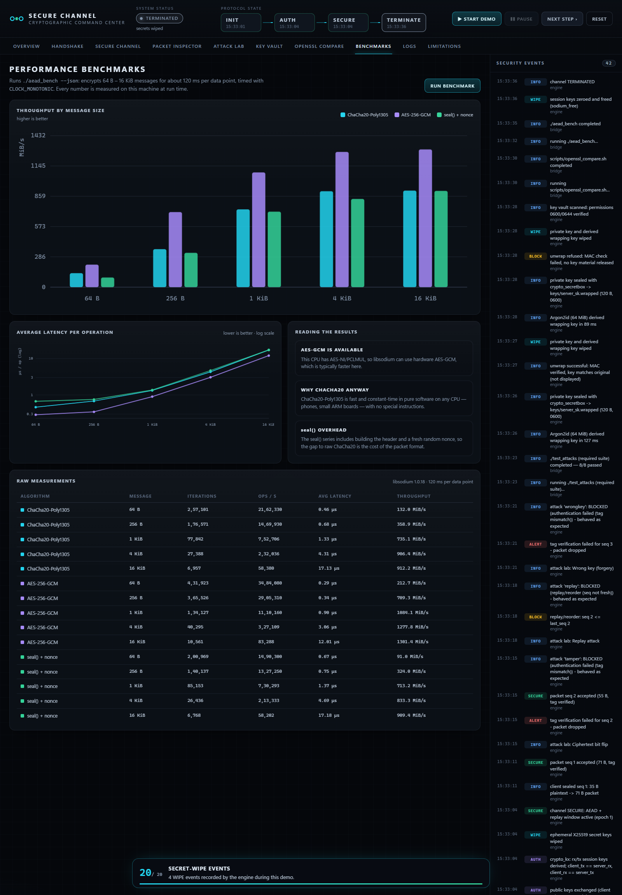 Benchmarks |
| 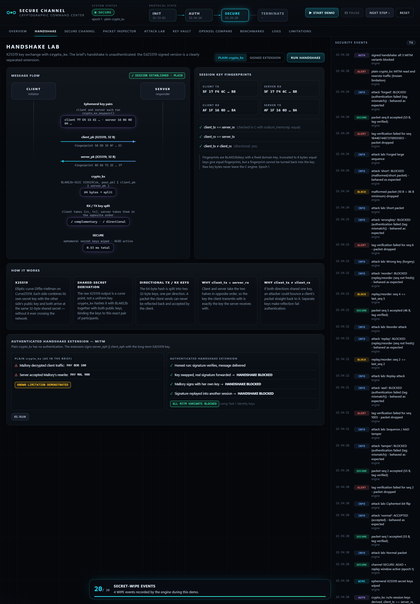 Signed handshake vs MITM | 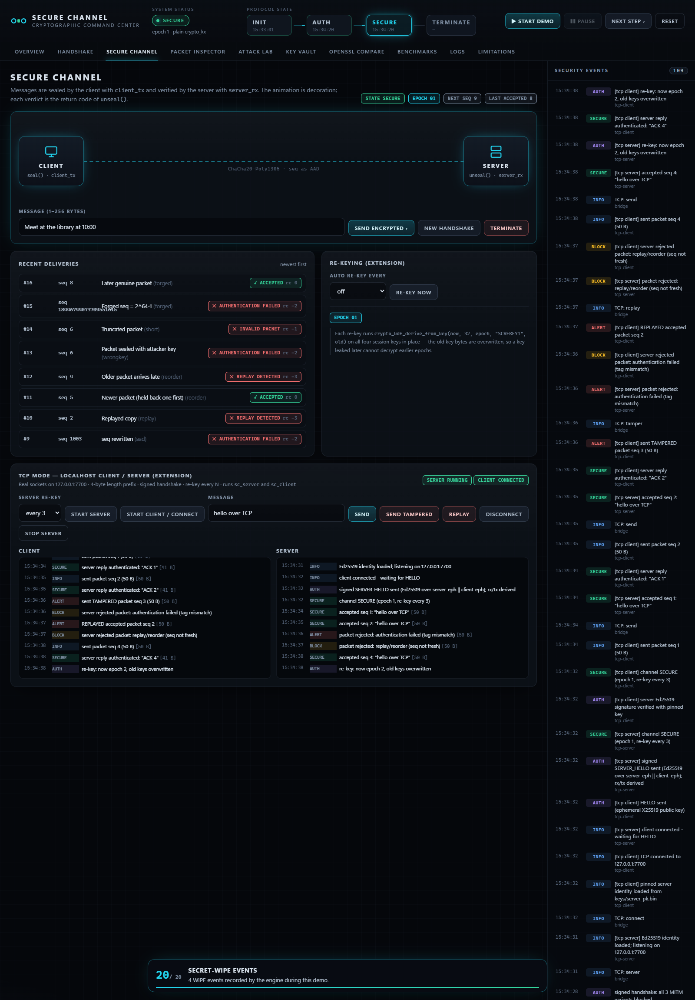 TCP mode |

## References

- libsodium documentation — https://doc.libsodium.org/
- RFC 8439 — ChaCha20 and Poly1305 for IETF Protocols
- RFC 9106 — Argon2 Memory-Hard Function
- RFC 7748 — Elliptic Curves for Security (X25519)
- RFC 8032 — Edwards-Curve Digital Signature Algorithm (Ed25519)
