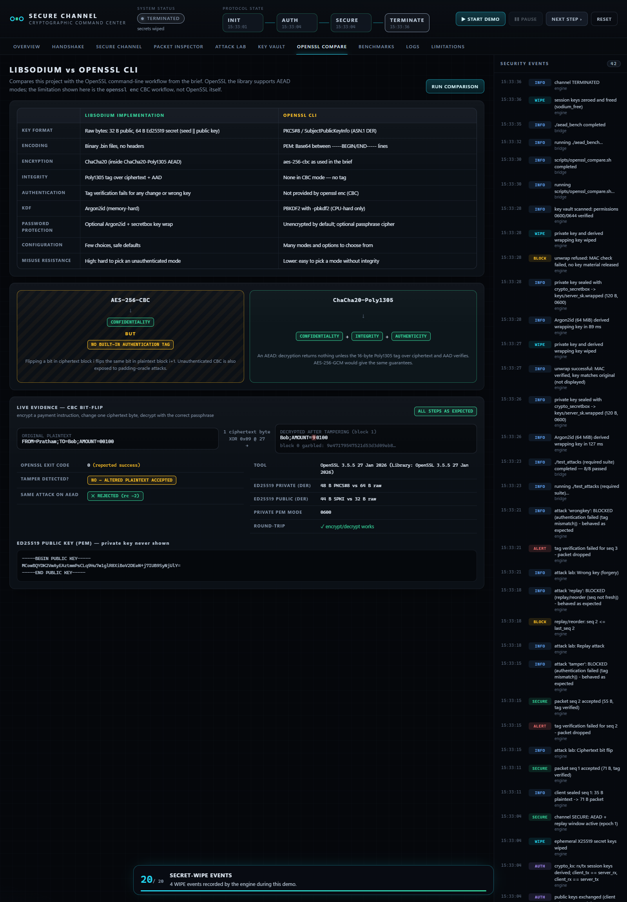

# Workshop 2: Build a Secure Channel with libsodium (and OpenSSL)

**Applied Cryptographic Design — Individual Project Report**

| | |
|---|---|
| Student | Pratham (ID: __________) |
| Module / Course | ____________________ |
| Submission date | 24 October 2026 |
| Repository | [INSERT GITHUB URL] |

---

## 1. Introduction and aims

This project builds a small secure communication channel in C using the libsodium library, and compares it with the OpenSSL command-line tool. A secure channel has to give three guarantees:

- **Confidentiality**: nobody on the network can read the messages.
- **Integrity / authenticity**: nobody can change a message without the receiver noticing.
- **Freshness**: an old message cannot be replayed, and messages cannot be reordered.

The work is split into six tasks: key generation and storage (1), key exchange (2), authenticated encryption (3), replay protection with attack tests (4), password-based key wrapping (5), and an OpenSSL comparison (6). Two optional stretch challenges were also completed: an Ed25519-signed handshake that stops a man-in-the-middle, and an AEAD benchmark. A terminal demo program ties everything together for the live presentation.

## 2. Threat model

The attacker controls the network between client and server. They can:

- **read** every packet (passive eavesdropping),
- **modify** any byte of a packet,
- **replay** a packet they saw earlier,
- **reorder** packets or **drop** them,
- **inject** packets of any length and content, including forged sequence numbers.

The attacker **cannot** read files on the server's disk protected by 0600 permissions, and does not know the Argon2id passphrase. A stolen disk or backup is covered by Task 5.

Dropping packets cannot be prevented by cryptography alone; the design only guarantees that a dropped packet is never silently replaced by a forged one. Plain `crypto_kx` does **not** defend against an *active* man-in-the-middle during the handshake; that gap and its fix are covered in Section 16 and the MITM stretch.

## 3. Design

The channel consists of:

1. A long-term **Ed25519** identity key pair and an **X25519** key-exchange pair for the server, stored in `keys/` (Task 1).
2. A **handshake** in which client and server exchange ephemeral X25519 public keys and derive two session keys with `crypto_kx` (Task 2).
3. A **record layer**, `seal()` / `unseal()`, that turns each message into an authenticated, encrypted packet (Tasks 3–4).
4. **Key wrapping** that encrypts the private key on disk under a passphrase (Task 5).

All code shares one header, `src/common.h`, which defines every length (sequence, nonce, tag, header) in one place so sender and receiver can never disagree.

## 4. State machine

```
┌────────┐  keys loaded   ┌────────┐  session keys   ┌──────────┐  close / error  ┌─────────────┐
│  INIT  │ ─────────────► │  AUTH  │ ──────────────► │  SECURE  │ ──────────────► │  TERMINATE  │
└────────┘                └────────┘   agree         └──────────┘                 └─────────────┘
 sodium_init()            exchange public keys       seal()/unseal() allowed      sodium_memzero /
 load key files           crypto_kx_*_session_keys   replay window active         sodium_free secrets
```

`kx_demo` prints each transition. In the live demo (`./secure_demo`), `seal()` is refused unless the channel is in SECURE, for example: *"Message refused — Channel is in state INIT, not SECURE"*. TERMINATE frees the session keys with `sodium_free()`, which zeroes them first.

## 5. Packet format

```
┌──────────────────┬──────────────┬─────────────────────┬──────────────┐
│ seq (8 B, BE)    │ nonce (12 B) │ ciphertext (n B)    │ tag (16 B)   │
│ clear, but AAD   │ random       │ ChaCha20            │ Poly1305     │
└──────────────────┴──────────────┴─────────────────────┴──────────────┘
          header = 20 B                       minimum packet = 36 B
```

- **seq** is a 64-bit big-endian counter. It is sent in clear so the receiver can check freshness before decrypting, and it is passed to the AEAD as *additional authenticated data*, so it is covered by the tag.
- **nonce** is 12 random bytes, fresh for every packet.
- **ciphertext + tag** is the output of `crypto_aead_chacha20poly1305_ietf_encrypt`.

Example from a real run of the demo, with message `"Meet at the library at 10:00"` (28 bytes): packet = 20 header + 28 ciphertext + 16 tag = **64 bytes**.

## 6. Implementation overview

| File | Purpose |
|---|---|
| `src/common.h` | Constants, key paths, return codes, prototypes |
| `src/keyio.c` | `write_file_0600()`, `write_file_pub()`, exact-size `read_file()` |
| `src/aead.c` | `seal()` and `unseal()` with AAD and replay protection |
| `src/keygen.c` | Task 1 |
| `src/kx_demo.c` | Task 2 + Task 3 round-trip |
| `tests/test_attacks.c` | Task 4 attack simulations |
| `src/keywrap.c` | Task 5 |
| `scripts/openssl_compare.sh` | Task 6 |
| `src/handshake.c`, `src/session.c`, `src/wrap.c` | Shared modules: signed handshake + re-key + fingerprints, INIT→AUTH→SECURE→TERMINATE state machine, Argon2id key wrapping |
| `src/mitm_demo.c`, `src/benchmark.c` | Stretch challenges 2 and 4 |
| `src/net.c`, `src/tcp_server.c`, `src/tcp_client.c` | Stretch challenge 1: localhost TCP client/server (with stretch 3, re-keying) |
| `src/engine.c`, `src/json.c` | `sc_engine`: machine-readable interface used by the dashboard |
| `src/demo.c`, `src/ui.c` | Terminal presentation demo and formatting |
| `tests/test_extended.c`, `bridge/test_integration.js` | Extended C tests (35) and UI/backend integration tests (46) |
| `bridge/server.js`, `dashboard/` | Local web dashboard ("Cryptographic Command Center") |

Everything is built by one `Makefile` with `-Wall -Wextra -Wpedantic -Wshadow -Wformat=2 -O2 -fstack-protector-strong -D_FORTIFY_SOURCE=2`. The build produces **zero warnings**.

### Changes made to the guide's starter code

The guide's code was followed closely, with these deliberate hardening changes:

1. `seal()` and `unseal()` take an explicit **output capacity** (`out_cap`, `pt_cap`), so a caller can never overflow a buffer. They reject messages over 64 KiB, and `unseal()` has an extra return code `-4` for an output buffer that is too small.
2. `read_file()` rejects a key file whose size is not **exactly** the key length. A partially read key is wiped.
3. Key files are opened with `O_NOFOLLOW` (refuses a planted symlink) and `O_CLOEXEC`. Public keys also get an explicit `fchmod(0644)` so the umask cannot change them.
4. On authentication failure, `unseal()` zeroes the output buffer.
5. The loader test in Task 1 is **functional**: a signature made with the reloaded key must verify.

## 7. Task 1 — Key generation and storage

`keygen` calls `sodium_init()` and aborts if it fails. It then generates an Ed25519 signing pair (`crypto_sign_keypair`) and an X25519 pair (`crypto_kx_keypair`), and writes four files:

| File | Content | Mode |
|---|---|---|
| `keys/server_pk.bin` | Ed25519 public key (32 B) | 0644 |
| `keys/server_sk.bin` | Ed25519 secret key (64 B) | **0600** |
| `keys/server_kx_pk.bin` | X25519 public key (32 B) | 0644 |
| `keys/server_kx_sk.bin` | X25519 secret key (32 B) | **0600** |

```c
int fd = open(path, O_WRONLY | O_CREAT | O_TRUNC | O_NOFOLLOW | O_CLOEXEC, mode);
if (fd < 0) return -1;
if (fchmod(fd, mode) != 0 || write_all(fd, buf, len) != 0) { close(fd); return -1; }
```

The file is **created** with mode 0600, so it never exists with looser permissions. `fopen()` followed by `chmod()` would leave a window in which the file has the default mode (often 0644) and another user could open it and keep the file descriptor. `fchmod()` is still called because `open()` ignores the mode when the file already exists.

After writing, the secret buffers are wiped with `sodium_memzero()`. A plain `memset()` on a buffer that is never read again can be removed by the optimiser as a "dead store"; `sodium_memzero()` is guaranteed to run.

The program then checks each file's mode with `stat()`. It reloads both private keys and proves they work: it signs a test message with the reloaded Ed25519 key and verifies it with the public key, and it recomputes the X25519 public key from the reloaded secret. If permissions are not enforced (for example on a Windows drive under WSL without `metadata`), it reports **FAIL** rather than pretending.

Result:

```
-rw-r--r-- 1 pratham_gosai pratham_gosai 32 Sep 30 14:25 server_kx_pk.bin
-rw------- 1 pratham_gosai pratham_gosai 32 Sep 30 14:25 server_kx_sk.bin
-rw-r--r-- 1 pratham_gosai pratham_gosai 32 Sep 30 14:25 server_pk.bin
-rw------- 1 pratham_gosai pratham_gosai 64 Sep 30 14:25 server_sk.bin
```

[INSERT SCREENSHOT: ./keygen output and ls -l keys/]

## 8. Task 2 — Key exchange and session keys

Client and server each create an ephemeral X25519 key pair and exchange only the public keys. `crypto_kx_client_session_keys()` and `crypto_kx_server_session_keys()` each produce two 32-byte keys, `rx` and `tx`:

```
client_tx == server_rx : YES
client_rx == server_tx : YES
client_tx == client_rx : NO (should be NO)
```

The comparisons use `sodium_memcmp()` (constant time), and the key bytes are never printed. Because each direction has its own key, a packet the client sent cannot be reflected back and accepted by the client. `kx_demo` tests this: bouncing the client's packet back gives `-2` (authentication failed). The ephemeral secret keys are wiped as soon as the session keys exist, which gives forward secrecy for the session.

[INSERT SCREENSHOT: ./kx_demo output]

## 9. Task 3 — AEAD and packet format

`seal()` writes the sequence number in big-endian, fills 12 random nonce bytes with `randombytes_buf()`, and calls `crypto_aead_chacha20poly1305_ietf_encrypt` with the 8 sequence bytes as AAD:

```c
store_be64(seqb, seq);
randombytes_buf(nonce, NONCE_LEN);
crypto_aead_chacha20poly1305_ietf_encrypt(ct, &ct_len, pt, pt_len,
        seqb, SEQ_LEN,          /* AAD = seq: clear text, but authenticated */
        NULL, nonce, key);
```

`unseal()` works in a fixed order:

1. Reject a packet shorter than 36 bytes (header + tag) or longer than the maximum, **before any cryptographic work** (`-1`).
2. Read `seq` and reject it if it is not greater than `last_seq` (`-3`). This step only *reads* the state.
3. Verify the tag and decrypt (`-2` on failure; the output buffer is wiped).
4. Only now update `last_seq`, and return the plaintext.

Checkpoint (`kx_demo`): `Round-trip: "hello secure world"`. That is 18 B of plaintext in a 54 B packet.

## 10. Task 4 — Replay protection and attack simulations

`tests/test_attacks.c` runs eight attacks, each with a fresh replay state and a fresh packet:

| # | Test | Action | Expected | Result |
|---|---|---|---|---|
| 1 | Round-trip | seal then unseal | plaintext matches, rc 0 | PASS |
| 2 | Tamper | flip one ciphertext byte | reject, rc -2 | PASS |
| 3 | AAD tamper | change the seq bytes | reject, rc -2 | PASS |
| 4 | Replay | send the same packet twice | second rejected, rc -3 | PASS |
| 5 | Reorder | seq 3 then seq 2 | seq 2 rejected, rc -3 | PASS |
| 6 | Wrong key | decrypt with another key | reject, rc -2 | PASS |
| 7 | Short packet (extra) | 10-byte packet | reject, rc -1 | PASS |
| 8 | Forged seq (extra) | tampered seq=1000, then seq 5 | seq 5 still accepted, rc 0 | PASS |

Result from `make test`: **8 passed, 0 failed**.

Test 8 also checks that `has_seq` is still 0 after the forged packet, which proves directly that the state was not touched. The live demo repeats these attacks on a running session. It also rewrites a packet's seq to 2⁶⁴−1, shows that it is rejected, and shows that the genuine packet is accepted afterwards.

[INSERT SCREENSHOT: ./test_attacks boxed output showing RESULT: 8/8 PASS]


## 11. Task 5 — Encrypted key storage (key wrapping)

A private key protected only by file permissions is exposed if the disk or a backup is stolen. `keywrap` encrypts the Task 1 Ed25519 secret key under a passphrase:

1. A random 16-byte **salt** and a random 24-byte **nonce** are generated.
2. **Argon2id** (`crypto_pwhash`, `OPSLIMIT_INTERACTIVE`, `MEMLIMIT_INTERACTIVE` = 64 MiB) derives a 32-byte key from passphrase + salt.
3. `crypto_secretbox_easy` (XSalsa20-Poly1305) encrypts the 64-byte key.
4. The file `keys/server_sk.wrapped` is written with mode 0600.

```
salt (16) | nonce (24) | MAC (16) + ciphertext (64)   = 120 bytes
```

A wrong passphrase gives a different key, so the Poly1305 MAC check fails and **no key material is returned**. The output buffer is wiped. Measured on the test machine, one Argon2id derivation took about **130 ms**. That is negligible for one login, but it multiplies the cost of every guess an attacker makes, and the 64 MiB memory requirement stops GPUs from running thousands of guesses in parallel cheaply.

| Test | Result |
|---|---|
| Correct password | PASS (unwrapped, matches original) |
| Wrong password | PASS (rejected) |
| Tampered wrapped file (extra) | PASS (rejected) |
| Two wraps of the same key differ (fresh salt, extra) | PASS |

The automated test uses built-in passphrases that are clearly marked **TEST-ONLY** and never printed. For real use, `./keywrap --interactive` reads the passphrase with terminal echo switched off.

[INSERT SCREENSHOT: ./keywrap output]


## 12. Task 6 — OpenSSL comparison

`scripts/openssl_compare.sh` runs the commands from the brief with OpenSSL 3.5.5:

```bash
openssl genpkey -algorithm ED25519 -out ed_priv.pem
openssl pkey -in ed_priv.pem -pubout -out ed_pub.pem
openssl genpkey -algorithm X25519 -out x_priv.pem
openssl enc -aes-256-cbc -salt -pbkdf2 -in message.txt -out message.enc
openssl enc -d -aes-256-cbc -pbkdf2 -in message.enc
```

Observations from the run:

- The PEM public key is Base64 text between `-----BEGIN PUBLIC KEY-----` lines. Its DER form is 44 bytes, compared with 32 raw bytes in libsodium.
- The Ed25519 private key is 48 bytes of PKCS#8 DER (ASN.1 wrapping a 32-byte seed). libsodium stores 64 raw bytes (seed ‖ public key).
- OpenSSL 3.5.5 created `ed_priv.pem` with mode 0600, but the key is **not encrypted** unless a passphrase cipher is requested.
- **Tamper demonstration.** The script encrypts `FROM=Pratham;TO=Bob;AMOUNT=00100` with `aes-256-cbc`, XORs one byte of the first ciphertext block with `0x09`, and decrypts. `openssl enc -d` **exits successfully**. The first plaintext block turns into 16 random-looking bytes, and the second reads `Bob;AMOUNT=90100`. The same change to this project's AEAD is rejected with `-2`.

[INSERT SCREENSHOT: openssl_compare.sh sections 4-7]



## 13. Extensions and dashboard

All four optional stretch challenges were implemented after the required tasks were passing. None of them changes `seal()`/`unseal()` or the required tests.

**Shared modules.** The terminal demo, the engine and the tests use one state machine (`session.c`), so INIT → AUTH → SECURE → TERMINATE is enforced in a single place. For example, `session_seal()` returns `SESSION_ERR_STATE` outside SECURE. Key wrapping moved into `wrap.c`, and the MITM scenario into `handshake.c`. `keywrap` and `mitm_demo` print exactly what they printed before.

**Authenticated handshake (stretch 2).** The server signs `"SC-HANDSHAKE-v1" ‖ server_eph_pk ‖ client_eph_pk` with its Task 1 Ed25519 key. The client verifies the signature with `crypto_sign_verify_detached` against the `server_pk.bin` it already trusts. Putting the client's key in the transcript stops a signature from one session being replayed into another. The scenario runs all three MITM variants: a substituted key with the real signature, a signature made with Mallory's own key, and a replayed signature. All three are blocked. The plain `crypto_kx` run is kept to show the original limitation.

**Re-keying (stretch 3).** `rekey_key()` replaces each session key in place with `crypto_kdf_derive_from_key(new, 32, epoch, "SCREKEY1", old)`. Both sides compute the same result without exchanging anything. The KDF is one-way, so a key leaked in epoch *n* does not reveal earlier epochs. Re-keying happens on demand or every N accepted messages. The extended tests check that a packet sealed under the old key fails after a re-key.

**TCP client/server (stretch 1).** `sc_server` and `sc_client` talk over 127.0.0.1:7700. Each frame is a 4-byte big-endian length, a 1-byte type, then the body. The length is checked against a maximum before anything is read. The handshake uses the signed transcript. Data frames carry the same packet format, the server answers with a sealed ACK, and both sides re-key every N messages. On BYE or disconnect, keys are freed with `sodium_free`. Tampered and replayed packets are rejected over real sockets, and a client pinned to a different identity aborts the handshake.

**Benchmark (stretch 4).** `aead_bench --json` measures ChaCha20-Poly1305, AES-256-GCM (only if the CPU supports it) and `seal()` from 64 B to 16 KiB, for about 120 ms per data point.

**Dashboard.** `sc_engine` holds a live session in `sodium_malloc()` memory. It reads one command per line and writes one JSON object per line, containing only public data: public keys, nonces, ciphertext, return codes, file modes, and 8-byte BLAKE2b fingerprints under a fixed domain key. A zero-dependency Node bridge serves the dashboard on 127.0.0.1 only. It whitelists and validates every command, requires a custom header on every POST (so other websites cannot drive it), checks the `Host` header against DNS rebinding, and sends a strict Content-Security-Policy. The dashboard has views for the handshake, the live channel, packet inspection, the eight attacks, a test center, the key vault, key wrapping, the OpenSSL comparison, benchmarks, logs and limitations. It is deliberately static: no animations or transitions. A 20-step Demo Mode runs the whole presentation against the real binaries. Every PASS/BLOCKED label is a return code from C. Nothing is precomputed.


## 14. Testing

All results below come from real runs on Ubuntu under WSL2 with gcc 15.2.0, GNU Make 4.4.1, libsodium 1.0.18 and OpenSSL 3.5.5.

| Command | What it checks | Result |
|---|---|---|
| `make` | builds 11 programs with strict warnings | 0 warnings |
| `make test` | Tasks 1–5 checkpoints | exit 0, 8/8 attack tests pass |
| `./test_extended` | packets, key files (0600, symlink refusal), wrapping, state machine, re-key, signed handshake | 35 passed, 0 failed |
| `make openssl` | Task 6 | all steps behaved as expected |
| `make mitm` | stretch 2 | MITM shown on plain kx; blocked with signatures |
| TCP (`sc_server`/`sc_client`) | stretch 1 + 3 over real sockets | tamper and replay rejected, re-key in sync, impostor blocked |
| `make audit` | 16-row terminal security audit | all checks pass |
| `npm run test:ui` | bridge security controls, every API, all 8 live attacks, TCP, secret-leak scan | 46 passed, 0 failed |

The complete captured output of `make test` is in `docs/output.txt`.

**Benchmark (stretch 4).** 100,000 encryptions of 1 KiB on the test machine (a CPU with AES-NI). The numbers vary slightly between runs:

| Algorithm | Time per op | Throughput |
|---|---|---|
| ChaCha20-Poly1305-IETF | ≈ 1.3 µs | ≈ 720–760 MiB/s |
| AES-256-GCM (AES-NI) | ≈ 0.8 µs | ≈ 1160–1200 MiB/s |
| `seal()` incl. random nonce + header | ≈ 1.35 µs | ≈ 710–730 MiB/s |

As expected, AES-GCM is faster on a CPU with hardware AES instructions. ChaCha20 is the safer default for portable code because it is fast and constant-time without special hardware. Building the packet and generating the random nonce add only a few percent to each `seal()`.

[INSERT SCREENSHOT: make test]
[INSERT SCREENSHOT: make audit dashboard]


[INSERT SCREENSHOT: pkg-config --modversion libsodium and openssl version]

## 15. OpenSSL comparison table

| Property | libsodium (this project) | OpenSSL CLI |
|---|---|---|
| Key format | Raw binary bytes (32 B public, 64 B Ed25519 secret) | PKCS#8 / SubjectPublicKeyInfo structures (ASN.1 DER) |
| Encoding | Binary `.bin`, no headers | PEM: Base64 text between `-----BEGIN/END-----` lines |
| Private-key protection | 0600 via `open()`+`fchmod()`; optional Argon2id wrap | 0600 in OpenSSL 3 (observed); unencrypted by default, can add `-aes256` (PBKDF2/scrypt) passphrase |
| Message encryption | ChaCha20-Poly1305 AEAD (confidentiality + integrity) | `aes-256-cbc`: confidentiality only, no tag |
| Tamper detection | Yes — 16-byte Poly1305 tag | No — the bit-flip decrypted without error |
| Password KDF | Argon2id (memory-hard) | PBKDF2 (CPU-hard only) |
| Misuse resistance | High — few choices, safe defaults | Lower — many modes, easy to pick a weak one |

OpenSSL itself is not insecure. The comparison is about the specific CLI workflow in the brief. OpenSSL's C API supports AEAD modes such as AES-256-GCM and ChaCha20-Poly1305, but `openssl enc` does not.

## 16. Answers to the design questions

**Q1. Why are private keys stored with 0600 permissions, created atomically?**
0600 means only the owner can read or write the file. Creating the file with that mode in `open()` means there is never a moment when it exists with looser permissions. With `fopen()` + `chmod()`, another local user could open the file during the gap and keep reading it through the file descriptor even after `chmod()`.

**Q2. Why does `crypto_kx` hash the shared secret together with both public keys?**
The raw X25519 output is a curve point, not a uniformly random key, so it is hashed (BLAKE2b-512) to become good key material. Including both public keys binds the session keys to *this exact pair of participants*: a substituted public key gives completely different keys. It also defends against small-subgroup and key-substitution tricks where different public keys could produce the same shared secret. Finally, it gives 64 bytes that are split into two direction-specific keys. Client and server take the halves in opposite order, which is why `client_tx == server_rx`.

**Q3. Why is the sequence number sent in clear but included as AAD?**
The receiver needs `seq` before decrypting to reject replays cheaply, so it cannot be inside the ciphertext. As AAD it is still covered by the Poly1305 tag. An attacker who changes it (test 3) makes the tag check fail, so they cannot "renumber" an old packet to make it look fresh.

**Q4. Why must `last_seq` be updated only after the tag verifies?**
Until the tag is verified, `seq` is just attacker-controlled bytes. If `last_seq` were updated first, one forged packet with `seq = 2^64−1` would fail authentication but still move `last_seq` to the maximum. Every genuine packet after it would then be rejected as a replay: a one-packet denial of service. Only authenticated data may change protocol state. Test 8 and the live demo both prove this.

**Q5. Which requirement does `aes-256-cbc` fail?**
**Integrity / authenticity.** CBC only hides data. In CBC, each plaintext block is XORed with the previous ciphertext block, so flipping a bit in ciphertext block *i* flips the same bit in plaintext block *i+1*. The script uses this to change `00100` into `90100`, and `openssl enc -d` reports success. CBC without a MAC is also vulnerable to padding-oracle attacks. The fix is an AEAD (AES-256-GCM or ChaCha20-Poly1305), or at minimum encrypt-then-MAC with HMAC-SHA256.

**Q6. Why `sodium_memzero()` instead of `memset()`?**
The compiler may delete a `memset()` on a buffer that is never read again (dead-store elimination), which would leave the key in memory. `sodium_memzero()` is written so the compiler cannot remove it.

## 17. Limitations

- **No identity authentication in plain `crypto_kx`.** An active man-in-the-middle can run two separate exchanges. `make mitm` shows Mallory reading `"PAY BOB 100"` and getting the server to accept `"PAY MAL 900"`. The stretch fix has the server sign `label ‖ server_eph_pk ‖ client_eph_pk` with its long-term Ed25519 key, and the client verify it against the trusted `server_pk.bin`. This defeats key substitution, a forged signature, and a signature replayed from another session. It still depends on the client obtaining `server_pk.bin` authentically.
- **Strict replay window.** A single `last_seq` drops every out-of-order packet. That is correct for TCP, but UDP would need a sliding-window bitmap such as those in IPsec and DTLS.
- **Random 96-bit nonces.** These are safe up to about 2³² messages per key (birthday bound). Using `seq` as the nonce, XChaCha20-Poly1305 (192-bit nonces), or re-keying would remove this limit.
- **Re-keying and TCP are extensions with their own limits.** In TCP mode the server announces `rekey_every` without authentication, so an active attacker could change it and desynchronise the two sides (denial of service only; it cannot reveal keys). The server handles one client at a time, and it answers rejected packets with a clear-text ALERT frame for the demo; a production protocol would drop the packet or close the connection. The core required tasks run client and server in one process.
- **Secrets in memory.** Stack buffers are wiped after use, and the demo keeps session keys in `sodium_malloc()` memory (mlocked, guard pages). Even so, a privileged attacker or a core dump could still expose keys while they are in use.
- **Argon2id parameters** use the `INTERACTIVE` preset. A long-term server key could justify `MODERATE` or `SENSITIVE`.
- This is an **educational** implementation and is not a replacement for TLS 1.3 or the Noise Protocol Framework.

## 18. Conclusion

The project implements every required task and verifies each one with automated checks. Keys are stored with safe permissions and can be wrapped with Argon2id. Session keys are derived per direction with X25519. Every packet is encrypted and authenticated with ChaCha20-Poly1305, with the sequence number bound as AAD. The replay state changes only after authentication, and all eight attack tests pass. The OpenSSL comparison shows in practice why confidentiality without integrity is not enough: a CBC ciphertext was altered undetected, while the same change against the AEAD was rejected. The main remaining weakness, the unauthenticated key exchange, is demonstrated and then fixed with an Ed25519-signed handshake.

## 19. References

1. libsodium documentation. https://doc.libsodium.org/
2. Y. Nir and A. Langley. *ChaCha20 and Poly1305 for IETF Protocols.* RFC 8439, 2018.
3. A. Biryukov, D. Dinu, D. Khovratovich and S. Josefsson. *Argon2 Memory-Hard Function for Password Hashing and Proof-of-Work Applications.* RFC 9106, 2021.
4. A. Langley, M. Hamburg and S. Turner. *Elliptic Curves for Security.* RFC 7748, 2016.
5. S. Josefsson and I. Liusvaara. *Edwards-Curve Digital Signature Algorithm (EdDSA).* RFC 8032, 2017.
6. OpenSSL 3 manual pages: `openssl-genpkey(1)`, `openssl-enc(1)`. https://www.openssl.org/docs/
7. S. Vaudenay. *Security Flaws Induced by CBC Padding.* EUROCRYPT 2002.
